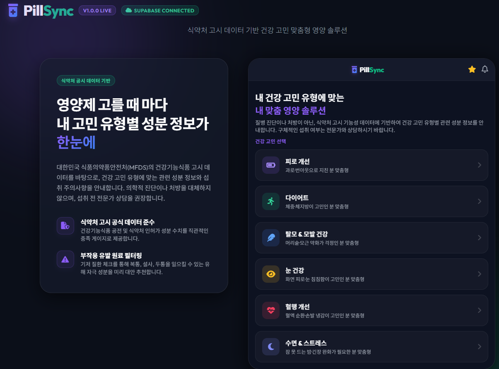
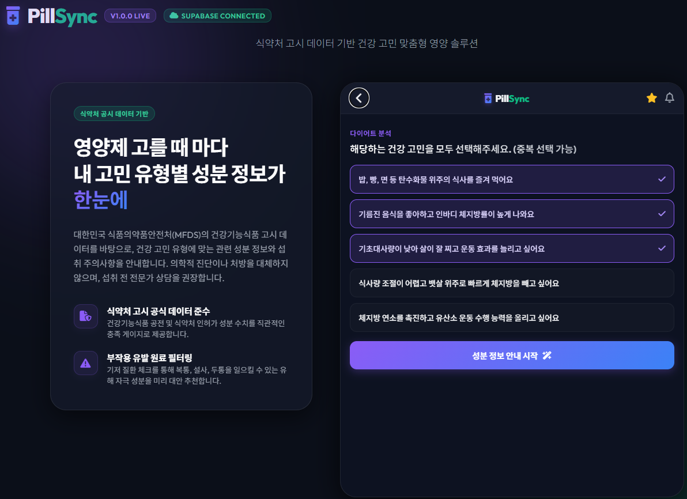

# PillSync (필싱크) 💊
> **식약처 고시 데이터 기반 건강기능식품 성분 매칭 및 분석 플랫폼**

PillSync는 대한민국 식품의약품안전처(MFDS)의 기능성 고시 데이터를 참조하여 사용자의 건강 고민에 맞는 최적의 영양소 정보를 매칭하고, 기저 질환 보유 여부에 따른 안전한 대안 성분을 안내하는 프리미엄 다크 모드 하이브리드 웹 애플리케이션입니다.

---

## 📸 서비스 화면 미리보기 (Service Previews)

<div align="center">
  <h3>1. 메인 및 건강 고민 카테고리 선택 화면</h3>
  
  <p><em>피로 개선, 다이어트, 탈모 및 모발 건강 등 3대 건강 고민 카테고리 선택 및 서비스 핵심 메리트 안내 대시보드</em></p>
  
  <br/>
  
  <h3>2. 세부 증상 및 라이프스타일 설문 화면</h3>
  
  <p><em>사용자별 구체적인 증상과 식습관, 운동 성향 등의 라이프스타일을 간편하게 다중 선택(Multi-select)할 수 있는 설문 페이지</em></p>
  
  <br/>
  
  <h3>3. 맞춤 성분 분석 및 복합 시너지 패키지 제안 화면</h3>
  
  <p><em>식약처 권장량 대비 충족 비율 게이지, 복용 메리트 및 부작용 가이드, 복수 증상 선택 시 자동 활성화되는 시너지 원료 조합 패키지 안내</em></p>
</div>

---

## 1. 주요 핵심 기능 (Key Features)

### 1) 식약처 고시 데이터 기반 성분 안내 (Nutrient Matching)
- **3대 주요 건강 카테고리**: 피로 개선(Purple), 다이어트(Green), 탈모 및 모발 건강(Blue) 맞춤 정보 제공.
- **식약처 기능성 요약**: 고시된 공식 기능성 설명, 하루 권장 섭취량, 일반적인 제품 기준 고함량 충족 비율 게이지 실시간 표출.
- **섭취 메리트 & 부작용 아코디언**: 복용 팁 및 고함량 복용 시의 메리트와 과다 복용 시 주의해야 할 부작용 정보 내장.

### 2) 복합 성분 참고 시너지 (Synergy Combinations)
- 설문 중 연관된 다수의 불편 증상을 동시에 선택할 시, 식약처 고시에 기반하여 복합 섭취하면 기전 시너지가 발생하는 조합 패키지(예: 활력 부스터, 모근 밀착 방어 등)를 자동으로 추출하여 안내합니다.

### 3) 기저질환자용 대안 성분 실시간 스왑 (Alternative Ingredient Swap)
- 사용자가 기저 상태(고혈압, 통풍 기왕력, 지성 여드름 피부, 위장 과민 등) 체크박스를 선택하면, 부작용 위험이 있는 기존 추천 성분 대신 **부작용이 없고 안전하게 기능을 대체할 수 있는 대안 성분으로 실시간 스왑(Swap)**하고 상세 추천 사유를 안내합니다.

### 4) 실시간 쿠팡 파트너스 연동 및 Direct 이동
- 추천 성분에 맞는 최적의 쿠팡 파트너스 딥링크(`coupang_link`)가 적용되어 즉시 다이렉트로 연결됩니다.
- 전자상거래법 및 표시광고법을 엄격히 준수하기 위해 상품 정보의 가격·리뷰 수 등이 예시 데이터임을 고지하고, 파트너스 수수료 고지 문구를 하단 배너에 통합하여 1회 노출합니다.

### 5) 법적 리스크 준수 (Legal Compliance)
- 의료법 제27조(무면허 의료행위) 및 표시광고법 위반 리스크를 원천 차단하기 위해 **"식약처 공인" 등의 주관적 단어를 배제**하고 **"식약처 고시 데이터 참조/기반"**으로 표현을 대대적으로 순화하였습니다.
- 민감 정보 수집 이슈 방지를 위해 수집된 데이터는 서버로 전송되지 않고 **브라우저 로컬 상태 내에서만 안전하게 일시 처리**된다는 안내 문구를 포함하고 있습니다.

### 6) 실시간 DB 및 관리자 설정 패널 (Developer Backoffice Admin Panel)
- 데스크톱 환경(주소창에 `?admin=true` 파라미터가 있을 때 작동)에서 에뮬레이팅된 모바일 화면 옆에 실시간 DB 스키마 뷰어 및 신규 카테고리/성분 추가 폼을 탑재하여 백오피스 관리가 가능합니다.

---

## 2. 하이브리드 아키텍처 및 폴백 (Hybrid Architecture)
PillSync는 클라우드와 로컬 오프라인 환경 모두를 지원하는 하이브리드 설계로 구현되어 있습니다.

* **Supabase 클라우드 모드 (Default)**: Supabase에 구축된 SQL 테이블(`categories`, `symptoms`, `ingredients_mapping`, `synergy_combinations`, `synergy_ingredients`) 데이터를 실시간 비동기 연동하여 동작합니다.
* **로컬 오프라인 폴백 모드 (Local Fallback)**: 클라우드 접속 정보가 없거나 네트워크 통신 불가 등 예외 발생 시, 로컬 내장 모의 데이터 객체로 끊김 없이 자동 전환되어 앱 기능의 중단 없는 사용을 보장합니다.

---

## 3. 디렉토리 구조 (Directory Layout)
```
PillSync/
├── docs/                                 # 프로젝트 문서 보관 폴더
│   ├── specs/                            # 핵심 설계 및 디자인 시스템 명세서
│   │   ├── development_specification.md  # 기능 요구사항
│   │   ├── kfda_ingredient_spec.md       # 식약처 고시 원료 설명문 스펙
│   │   ├── system_architecture.md        # 시스템 흐름, DB 스키마 및 RLS 명세
│   │   └── design_system.md              # 컬러 토큰, 폰트 및 모바일 레이아웃 명세
│   └── daily_logs/
│       └── daily_log_20260615.md         # 일일 개발 및 버그 수정 로그
├── public/                               # 로고, 정적 리소스 자산
├── src/
│   ├── App.jsx                           # 메인 모바일 에뮬레이터 및 비즈니스 로직 컴포넌트
│   ├── index.css                         # UI 전반의 퓨처리즘 다크테마 CSS 스타일시트
│   ├── main.jsx                          # React 렌더링 엔트리
│   └── supabaseClient.js                 # Supabase SDK 연결 상태 감지 모듈
├── supabase_schema.sql                   # Supabase DB 이식용 SQL 백업 스크립트
├── package.json                          # 빌드 스크립트 및 모듈 의존성 정의
└── vite.config.js                        # Vite 컴파일러 환경 정의
```

---

## 4. 설치 및 실행 가이드 (Getting Started)

### 1) 로컬 패키지 설치
```bash
# 의존성 패키지 설치
npm install
```

### 2) 환경 변수 설정 (.env)
프로젝트 루트 디렉토리에 `.env` 파일을 생성하고 Supabase 연결 키를 입력합니다. (미설정 시 오프라인 로컬 목업 모드로 실행됩니다.)
```env
VITE_SUPABASE_URL=YOUR_SUPABASE_PROJECT_URL
VITE_SUPABASE_ANON_KEY=YOUR_SUPABASE_ANON_PUBLIC_KEY
```

### 3) 로컬 개발 서버 실행
```bash
# 개발 모드 기동 (http://localhost:5173/)
npm run dev
```

### 4) 어드민 패널 활성화
어드민 백오피스 조절 뷰를 데스크톱 화면에 노출하고 싶다면 로컬 기동 주소 뒤에 쿼리 스트링을 붙여 진입합니다:
> `http://localhost:5173/?admin=true`

### 5) 프로덕션 빌드
```bash
# 빌드 실행
npm run build
```

---

## 5. 데이터베이스 이식 방법 (Supabase DB Setup)
클라우드 데이터베이스 모드를 구동하기 위해 아래 가이드를 진행합니다.
1. Supabase 프로젝트의 **SQL Editor**로 이동합니다.
2. 새 쿼리창(New Query)을 엽니다.
3. 프로젝트 루트에 있는 [supabase_schema.sql](file:///c:/Users/stone/projects/PillSync/supabase_schema.sql) 파일의 전체 내용을 복사하여 붙여넣습니다.
4. **Run** 버튼을 눌러 테이블 생성, 보안 정책(RLS) 주입 및 초기 시드 데이터를 적재합니다.
