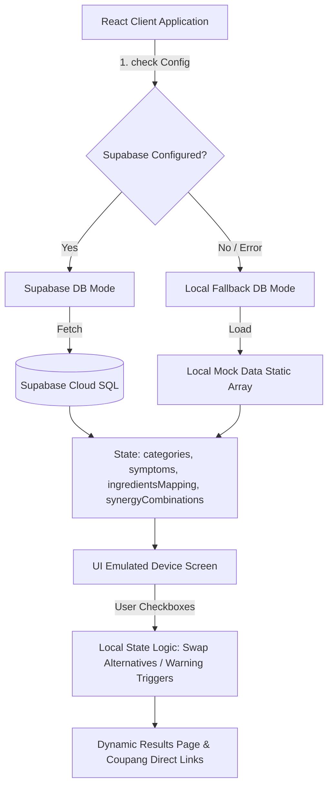
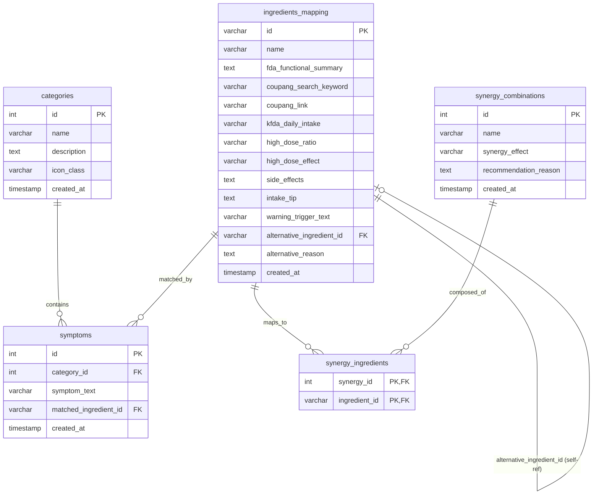

# PillSync System Architecture Specification

## 1. 아키텍처 개요
PillSync는 사용자의 건강 불편 증상을 기반으로 대한민국 식품의약품안전처(MFDS)의 기능성 고시 원료 데이터를 활용하여 최적의 영양소 조합 및 관련 복합 성분 시너지를 안내하고, 실시간 쿠팡 파트너스 상품 정보로 연결해 주는 어플리케이션입니다.

클라우드 기반 데이터 구조(Supabase)와 클라이언트 독립형 구조(Offline Local Fallback)가 유기적으로 연결된 **하이브리드 데이터 아키텍처**를 가지고 있습니다.

---

## 2. 데이터 흐름 및 아키텍처


### 1) Supabase Cloud DB 연동 프로세스
- 애플리케이션 시작 시 `supabaseClient.js` 설정을 감지하여 자동 연결합니다.
- 테이블 조회 성공 시 실시간 데이터를 바탕으로 상태(State)를 업데이트하며 `dbMode`는 `"Supabase Connected"`로 유지됩니다.
- 행 레벨 보안(RLS) 정책이 테이블별로 선언되어 있어 public Read/Write가 인가되어 있습니다.

### 2) Local Fallback (오프라인/로컬 예외 처리)
- 환경 변수(.env) 미설정 또는 네트워크 오류 시 로컬 목업 데이터 객체(`localCategories`, `localSymptoms`, `localIngredientsMapping`, `localSynergyCombinations`)로 매끄럽게 폴백(Fallback) 전환됩니다.
- 이를 통해 클라우드 연결이 실패하더라도 핵심 기능(질환별 대체 가이드, 시너지 계산, 쿠팡 최저가 링크)이 즉각 무중단 작동합니다.

---

## 3. 데이터베이스 스키마 모델링
PillSync의 Supabase 데이터베이스는 5가지 연관 테이블로 구성되며, 성분 간의 대안 추천을 위해 **자가 참조(Self-Referencing) 외래키**가 적용되어 있습니다.



### 1) RLS (Row Level Security) 정책
비로그인 사용자도 맞춤 매칭 서비스와 어드민 뷰를 정상 조회 및 입력할 수 있도록 모든 테이블에 대해 public Read/Insert가 허용되어 있습니다.
- `FOR SELECT USING (true)`
- `FOR INSERT WITH CHECK (true)`

---

## 4. 디렉토리 구조 및 역할
```
PillSync/
├── docs/
│   ├── specs/
│   │   ├── development_specification.md  # 개발 요구사항 & 기능 명세
│   │   ├── kfda_ingredient_spec.md       # 식약처 고시 성분 스펙
│   │   ├── system_architecture.md        # [본 문서] 시스템 아키텍처 명세
│   │   └── design_system.md              # UI/UX 및 디자인 시스템 스펙
│   └── daily_logs/
│       └── daily_log_20260615.md         # 개발 이력 로그
├── public/                               # 정적 자산 폴더
├── src/
│   ├── App.jsx                           # 메인 엔트리 및 UI 컴포넌트 총괄
│   ├── index.css                         # 테마 토큰 및 전역 스타일
│   ├── main.jsx                          # React 렌더러
│   └── supabaseClient.js                 # Supabase 초기화 및 설정 확인 모듈
├── supabase_schema.sql                   # Supabase 백업용 DDL & Seed SQL 스크립트
├── package.json                          # 의존성 및 스크립트 설정
└── vite.config.js                        # 빌드 도구 설정
```

---

## 5. 컴포넌트 상태(State) 관리 아키텍처
클라이언트 컴포넌트는 단일 `App.jsx`에서 반응형 상태 흐름을 직접 관리합니다.

1. **DB 상태**: `categories`, `symptoms`, `ingredientsMapping`, `synergyCombinations`
   - DB 로딩 완료 시 Supabase 혹은 Local Fallback 데이터로 주입되어 변경 불가능(Immutable)한 마스터 테이블 역할을 수행합니다.
2. **선택 상태**: `selectedSymptomIds`, `currentCategoryId`
   - 사용자가 홈에서 진입한 카테고리 정보 및 체크박스를 통해 토글한 증상 ID 배열입니다.
3. **매칭 계산 상태**:
   - `matchedIngredientsList`: `selectedSymptomIds` 배열을 기반으로 매칭되는 성분을 `ingredientsMapping`에서 실시간 산출합니다.
   - `activeSynergies`: 현재 매칭된 성분 목록을 분석하여, 요구되는 성분이 모두 충족된 시너지 조합을 자동으로 필터링합니다.
4. **기저조건 스왑 상태**: `checkedWarnings`
   - 사용자가 부작용 트리거(예: 고혈압, 지성 피부 등) 체크박스를 선택하면 `alternative_ingredient_id`가 지정된 경우 대안 성분으로 화면 데이터와 쿠팡 상품 정보 카드가 실시간 스왑(Swap)됩니다.
